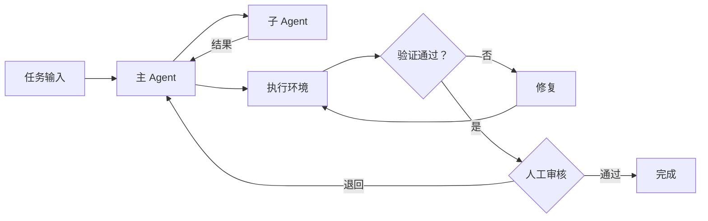

# Agent 工作流

```mermaid
flowchart LR
  task[任务输入] --> main[主 Agent]
  main --> child[子 Agent]
  child -->|结果| main
  main --> env[执行环境]
  env --> verify{验证通过？}
  verify -->|否| fix[修复]
  fix --> env
  verify -->|是| review{人工审核}
  review -->|退回| main
  review -->|通过| done[完成]
```
